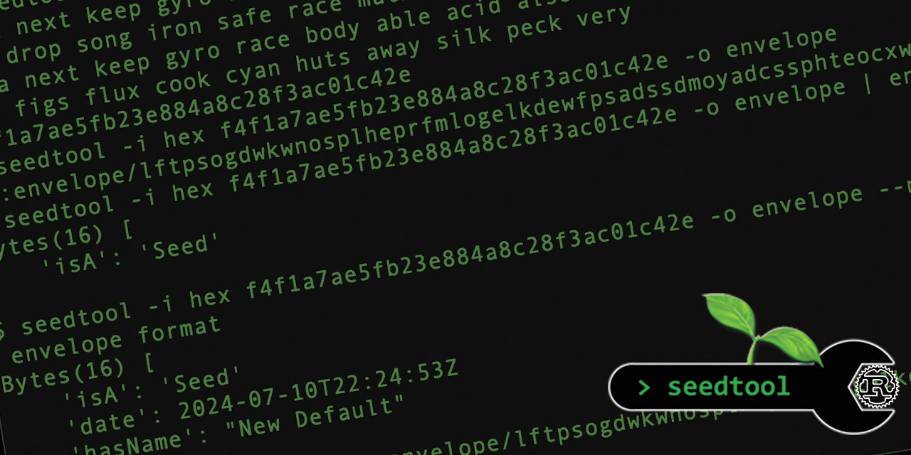

# 🌱 Blockchain Commons SeedTool Command Line Tool

<!--Guidelines: https://github.com/BlockchainCommons/secure-template/wiki -->

### _by [Wolf McNally](https://www.github.com/wolfmcnally) and [Christopher Allen](https://www.github.com/ChristopherA)_

**NOTE:** Preview version. Not ready for production use.

<p align="center">
  
</p>

## Introduction

`seedtool` is a command-line tool for creating and transforming cryptographic seeds of the sort commonly used by blockchain applications.

## Deprecation of C++ SeedTool

The [original SeedTool was written in C++](https://github.com/BlockchainCommons/seedtool-cli) and is now deprecated. The new SeedTool is a complete rewrite in Rust. The new SeedTool's inputs and outputs are mostly compatible with the old SeedTool, and most of the same command line options are supported. The new SeedTool is more flexible and extensible, and is designed to support additional functionality.

The new SeedTool also exclusively uses Gordian Envelope for exporting and importing seeds with metadata, for sharding seeds with SSKR, and for writing and reading seeds in multipart UR format.

If you have the old SeedTool installed, you should uninstall it before installing the new SeedTool, or ensure that the new SeedTool is in your PATH before the old SeedTool.

## Installation

To install from crates.io, run:

```bash
cargo install seedtool-cli
```

To install from source, clone this repo, change to its root directory and run:

```bash
cargo install --path .
```

## Examples

- Examples of usage can be found in [USAGE.md](./USAGE.md).
- The full user guide is in [MANUAL.md](./MANUAL.md).

## Version History

### 0.1.7: Not Yet Released

- Improved error message for failed SSKR join.

### 0.1.6: July 11, 2024

- The formats `base6`, `base10`, `bits`, `cards`, `dice`, and `ints`, are intended to be used as user-provided input entropy for generating seeds. `seedtool` can use them as input to generate a seed in any of the other formats, or it can generate these directly using the `random` input mode (which you only would need to do when simulating user-generated entropy). However, `seedtool` will now return an error if any of these formats are used for output with anything other than `random` input (the default). This means it will also return an error if asked to convert between these entropy input formats, for example, from `bits` to `dice`, as these are not reversible conversions.

### 0.1.5: July 1, 2024

- No significant changes.

### 0.1.4: June 20, 2024

- The new `--sskr-format` (`-s`) option can be used to specify SSKR output format, including envelope (the default), bytewords (standard, minimal, or URI styles), and `ur:sskr`.
- Parsing SSKR shares autodetects the format, and will handle all of the above formats, and also the legacy `ur:crypto-sskr` format.

## Status - Alpha

`seedtool`  is currently under active development and in the alpha testing phase. It should not be used for production tasks until it has had further testing and auditing. See [Blockchain Commons' Development Phases](https://github.com/BlockchainCommons/Community/blob/master/release-path.md).

## Financial Support

`seedtool` is a project of [Blockchain Commons](https://www.blockchaincommons.com/). We are proudly a "not-for-profit" social benefit corporation committed to open source & open development. Our work is funded entirely by donations and collaborative partnerships with people like you. Every contribution will be spent on building open tools, technologies, and techniques that sustain and advance blockchain and internet security infrastructure and promote an open web.

To financially support further development of `seedtool` and other projects, please consider becoming a Patron of Blockchain Commons through ongoing monthly patronage as a [GitHub Sponsor](https://github.com/sponsors/BlockchainCommons). You can also support Blockchain Commons with bitcoins at our [BTCPay Server](https://btcpay.blockchaincommons.com/).

## Contributing

We encourage public contributions through issues and pull requests! Please review [CONTRIBUTING.md](./CONTRIBUTING.md) for details on our development process. All contributions to this repository require a GPG signed [Contributor License Agreement](./CLA.md).

### Discussions

The best place to talk about Blockchain Commons and its projects is in our GitHub Discussions areas.

[**Gordian Developer Community**](https://github.com/BlockchainCommons/Gordian-Developer-Community/discussions). For standards and open-source developers who want to talk about interoperable wallet specifications, please use the Discussions area of the [Gordian Developer Community repo](https://github.com/BlockchainCommons/Gordian-Developer-Community/discussions). This is where you talk about Gordian specifications such as [Gordian Envelope](https://github.com/BlockchainCommons/Gordian/tree/master/Envelope#articles), [bc-shamir](https://github.com/BlockchainCommons/bc-shamir), [Sharded Secret Key Reconstruction](https://github.com/BlockchainCommons/bc-sskr), and [bc-ur](https://github.com/BlockchainCommons/bc-ur) as well as the larger [Gordian Architecture](https://github.com/BlockchainCommons/Gordian/blob/master/Docs/Overview-Architecture.md), its [Principles](https://github.com/BlockchainCommons/Gordian#gordian-principles) of independence, privacy, resilience, and openness, and its macro-architectural ideas such as functional partition (including airgapping, the original name of this community).

[**Gordian User Community**](https://github.com/BlockchainCommons/Gordian/discussions). For users of the Gordian reference apps, including [Gordian Coordinator](https://github.com/BlockchainCommons/iOS-GordianCoordinator), [Gordian Seed Tool](https://github.com/BlockchainCommons/GordianSeedTool-iOS), [Gordian Server](https://github.com/BlockchainCommons/GordianServer-macOS), [Gordian Wallet](https://github.com/BlockchainCommons/GordianWallet-iOS), and [SpotBit](https://github.com/BlockchainCommons/spotbit) as well as our whole series of [CLI apps](https://github.com/BlockchainCommons/Gordian/blob/master/Docs/Overview-Apps.md#cli-apps). This is a place to talk about bug reports and feature requests as well as to explore how our reference apps embody the [Gordian Principles](https://github.com/BlockchainCommons/Gordian#gordian-principles).

[**Blockchain Commons Discussions**](https://github.com/BlockchainCommons/Community/discussions). For developers, interns, and patrons of Blockchain Commons, please use the discussions area of the [Community repo](https://github.com/BlockchainCommons/Community) to talk about general Blockchain Commons issues, the intern program, or topics other than those covered by the [Gordian Developer Community](https://github.com/BlockchainCommons/Gordian-Developer-Community/discussions) or the
[Gordian User Community](https://github.com/BlockchainCommons/Gordian/discussions).

### Other Questions & Problems

As an open-source, open-development community, Blockchain Commons does not have the resources to provide direct support of our projects. Please consider the discussions area as a locale where you might get answers to questions. Alternatively, please use this repository's [issues](./issues) feature. Unfortunately, we can not make any promises on response time.

If your company requires support to use our projects, please feel free to contact us directly about options. We may be able to offer you a contract for support from one of our contributors, or we might be able to point you to another entity who can offer the contractual support that you need.

### Credits

The following people directly contributed to this repository. You can add your name here by getting involved. The first step is learning how to contribute from our [CONTRIBUTING.md](./CONTRIBUTING.md) documentation.

| Name              | Role                | Github                                            | Email                                 | GPG Fingerprint                                    |
| ----------------- | ------------------- | ------------------------------------------------- | ------------------------------------- | -------------------------------------------------- |
| Christopher Allen | Principal Architect | [@ChristopherA](https://github.com/ChristopherA)  | \<ChristopherA@LifeWithAlacrity.com\> | FDFE 14A5 4ECB 30FC 5D22  74EF F8D3 6C91 3574 05ED |
| Wolf McNally      | Lead Researcher/Engineer         | [@WolfMcNally](https://github.com/wolfmcnally)    | \<Wolf@WolfMcNally.com\>              | 9436 52EE 3844 1760 C3DC  3536 4B6C 2FCF 8947 80AE |

## Responsible Disclosure

We want to keep all of our software safe for everyone. If you have discovered a security vulnerability, we appreciate your help in disclosing it to us in a responsible manner. We are unfortunately not able to offer bug bounties at this time.

We do ask that you offer us good faith and use best efforts not to leak information or harm any user, their data, or our developer community. Please give us a reasonable amount of time to fix the issue before you publish it. Do not defraud our users or us in the process of discovery. We promise not to bring legal action against researchers who point out a problem provided they do their best to follow the these guidelines.

### Reporting a Vulnerability

Please report suspected security vulnerabilities in private via email to ChristopherA@BlockchainCommons.com (do not use this email for support). Please do NOT create publicly viewable issues for suspected security vulnerabilities.

The following keys may be used to communicate sensitive information to developers:

| Name              | Fingerprint                                        |
| ----------------- | -------------------------------------------------- |
| Christopher Allen | FDFE 14A5 4ECB 30FC 5D22  74EF F8D3 6C91 3574 05ED |

You can import a key by running the following command with that individual’s fingerprint: `gpg --recv-keys "<fingerprint>"` Ensure that you put quotes around fingerprints that contain spaces.
